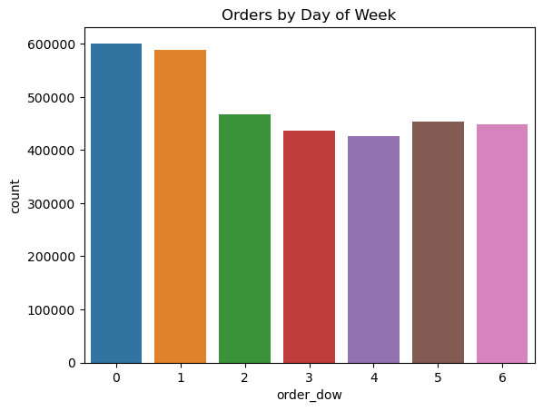
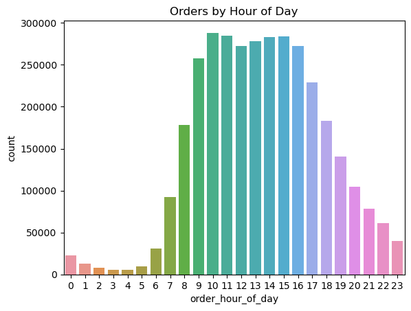
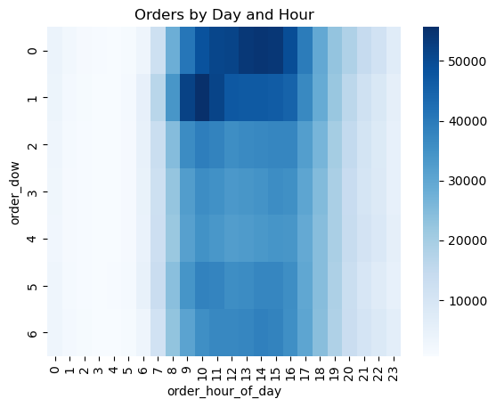
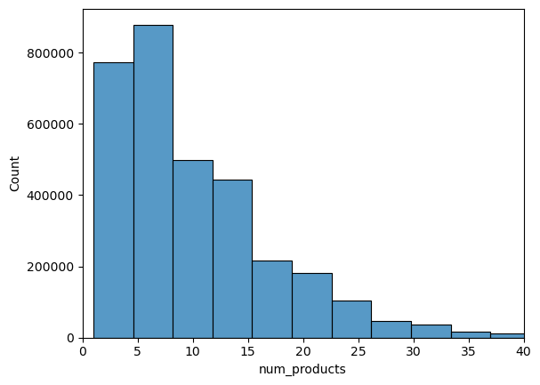
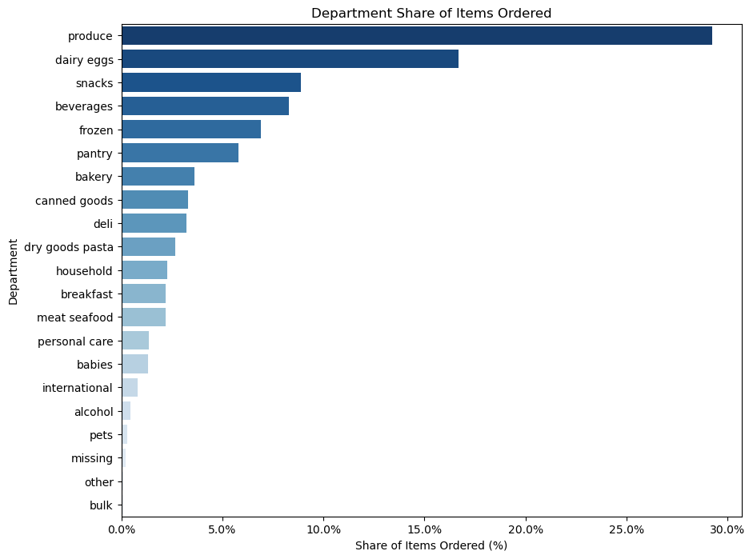
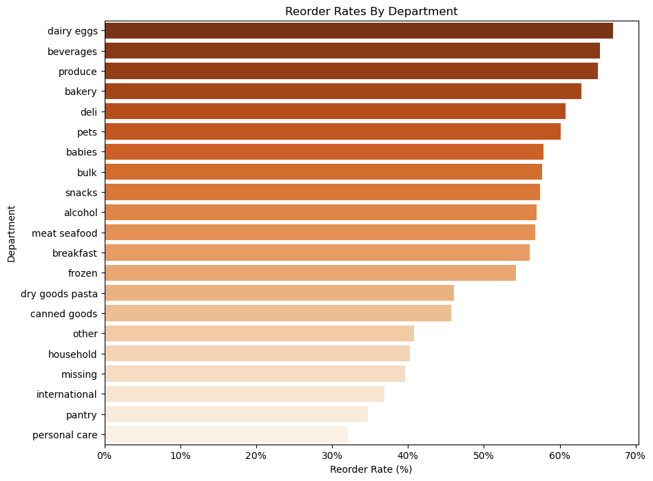

# Instacart Shopper Behavior & Basket Analysis

**Turning 3.4M grocery orders into category, basket, and loyalty insights.**

This project analyzes the [Instacart Market Basket dataset](https://www.kaggle.com/datasets/yasserh/instacart-online-grocery-basket-analysis-dataset) — 3.4M+ orders from 206K customers — to answer the kind of questions a category insights or shopper analytics team asks every day: *When do people shop? What's in the basket? Which categories drive loyalty, and which ones just get people in the door?* A dedicated deep-dive on the **dairy and cheese** category is included, given its direct relevance to CPG category management.

## Why this project

I built this to demonstrate the analytical skillset a Category/Shopper Insights role requires: turning raw transactional data into **clear, decision-ready recommendations** — the same workflow used to translate syndicated (Circana/NielsenIQ-style) and retail data into selling stories for Sales, Category Management, and Marketing.

- **Tools:** Python (pandas, NumPy), seaborn/matplotlib for visualization, Jupyter for exploratory analysis
- **Approach:** merge, segment, and aggregate transaction-level data → surface trends → translate into business recommendations
- **Full analysis:** [`instacart_analysis.ipynb`](instacart_analysis.ipynb)

---

## 1. Shopper Behavior: When Do Customers Order?

Across 206,209 customers and 3.4M orders, shoppers place an average of **16.6 orders** (median 10), roughly **11 days apart**.

<p align="center">
  
  
</p>

<p align="center">
  
</p>

**Key insight:** Orders peak on **Sunday and Monday**, concentrated in the **morning-to-mid-afternoon** window. This is a clear signal for timing promotions, ad placements, and inventory/replenishment cycles around the weekly planning cycle rather than spreading spend evenly across the week.

---

## 2. Basket Composition: What's in the Cart?

<p align="center">
  
</p>

- The average basket holds **10 items** (median 8); basket size is right-skewed — most orders (80%) contain **15 items or fewer**, with a smaller tail of large stock-up trips.
- Baskets typically span **~5 departments**, indicating shoppers treat Instacart as a **substitute for a full grocery trip**, not a quick single-category run — a relevant consideration for cross-category promotion and bundling strategy.

<p align="center">
  
</p>

**Produce (29.2%)** and **Dairy & Eggs (16.7%)** dominate basket share — together accounting for nearly half of all items ordered, well ahead of snacks and beverages. This underscores how central the dairy case is to basket value and trip frequency.

---

## 3. Loyalty & Reorder Behavior

<p align="center">
  
</p>

**Dairy & Eggs has the highest reorder rate of any department (~67%)**, ahead of beverages and produce — meaning dairy isn't just high-volume, it's the category customers come back to on autopilot. At the aisle level, **milk (78%)**, **eggs (71%)**, and **yogurt (69%)** rank among the very top reorder aisles across the entire dataset.

### New vs. Loyal Shopper Behavior

Comparing early orders (a customer's first 3) against later orders (10+) reveals how baskets evolve over the customer lifecycle:

| Trending **up** with tenure | Trending **down** with tenure |
|---|---|
| Fresh fruit, milk, yogurt, baby food/formula | Frozen meals, ice cream, frozen produce, soft drinks |

**Business implication:** staples (milk, yogurt, fresh produce) are what convert new users into repeat, loyal shoppers — the retention engine. Frozen/convenience items skew toward new-user acquisition but don't sustain loyalty. This maps directly to a promotional strategy: **use frozen/quick-item deals to welcome new shoppers, and staple-based offers (dairy, produce) to drive retention.**

---

## 4. Dairy & Cheese Category Deep-Dive

Given the relevance to dairy/cheese category management, I ran an additional focused cut on the cheese aisles:

| Metric | Value |
|---|---|
| Dairy & Eggs share of all items ordered | **16.7%** (2nd largest department) |
| Dairy & Eggs reorder rate | **~67%** (highest of any department) |
| Cheese aisles combined share of items ordered | **4.2%** |
| Cheese aisles combined reorder rate | **57.5%** |
| **Packaged cheese** reorder rate | **58.5%** |
| **Specialty cheese** reorder rate | **48.9%** |

**Reading the gap:** Packaged (everyday) cheese behaves like a staple — high, steady repeat-buy behavior similar to milk and yogurt. Specialty cheese has a meaningfully lower reorder rate, consistent with more occasion-driven, exploratory purchasing (entertaining, recipes, trial) rather than routine restock. This suggests different playbooks per segment: **everyday cheese** should be merchandised and promoted around routine replenishment (bundle with milk/yogurt staple deals), while **specialty cheese** likely benefits more from trial-driving tactics — sampling, recipe-based marketing, and premium/occasion positioning — to convert one-time buyers into repeat purchasers.

---

## Key Takeaways

1. **Timing:** Sunday–Monday, morning-to-afternoon is peak order activity — the highest-leverage window for promotional visibility.
2. **Basket strategy:** With baskets spanning ~5 departments, cross-category bundling (e.g., dairy + produce) mirrors actual shopping behavior.
3. **Dairy is a loyalty driver:** highest department-level reorder rate in the dataset — a critical anchor category for retention, not just volume.
4. **Segment cheese differently:** everyday/packaged cheese = routine restock behavior; specialty cheese = trial/occasion behavior requiring a different selling story.

---

## Repo Structure

```
├── instacart_analysis.ipynb   # Full analysis: data prep, EDA, segmentation, visualizations
├── images/                    # Exported chart visuals used in this README
└── data/                      # Raw Instacart CSVs (aisles, departments, orders, products, order_products)
```

**Data source:** [Instacart "The Instacart Online Grocery Shopping Dataset 2017"](https://www.instacart.com/datasets/grocery-shopping-2017), accessed via Kaggle.
